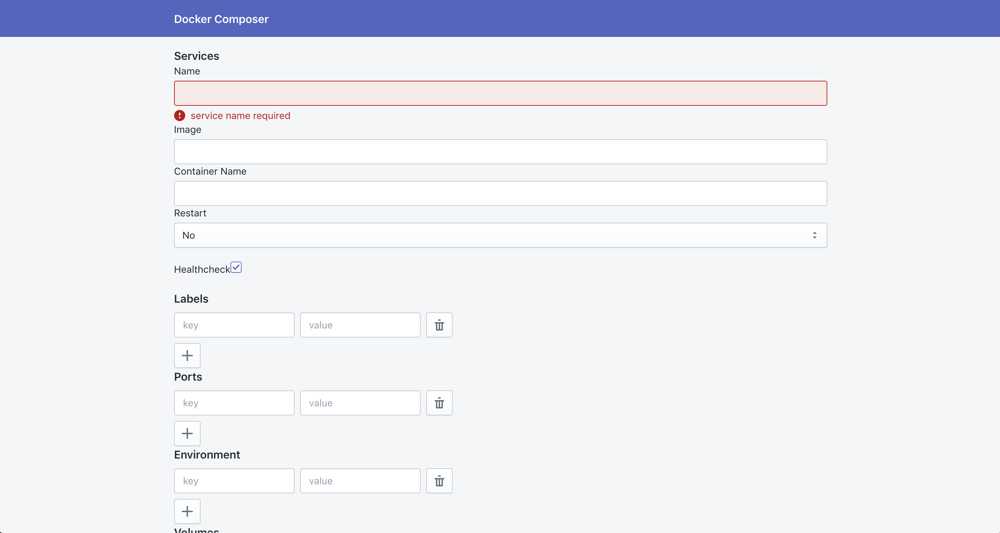

<!-- AUTO-GENERATED-CONTENT:START (STARTER) -->
<h1 align="center">
  <a href="https://docker-composer.netlify.com">Docker Composer</a>
</h1>

Docker composoer is UI tool to generate or update docker-compose.yml file.



It is not easy to write YAML file because every space you enter counts differently. This tool helps you to get started with docker compose easily. You need to fill the details as per your requirement and it will generate drop-in docker-compose.yml, which you can directly use it.

Docker compose has it's own syntax specification, you don't need to read 75 mins long documentation to write yaml file. Just use this tool and it will generate compose yaml for you.


## Development Setup

### Prerequisites

- NodeJS version 8 or above
- NPM
- [GatsbyJS CLI](https://www.gatsbyjs.org/)

### Installing

After cloning the project, run below command to install project dependencies.
```
npm install
```

Now, run below command to start development.

```
gatsby develop
```


### Authors
- [Yash Thakkar](https://github.com/thakkaryash94/)

### Links
- [Overview of Docker Compose](https://docs.docker.com/compose/overview/)
- [Docker Compose file version 3 reference](https://docs.docker.com/compose/compose-file/)

### License
This project is licensed under the MIT License - see the [LICENSE](LICENSE) file for details
